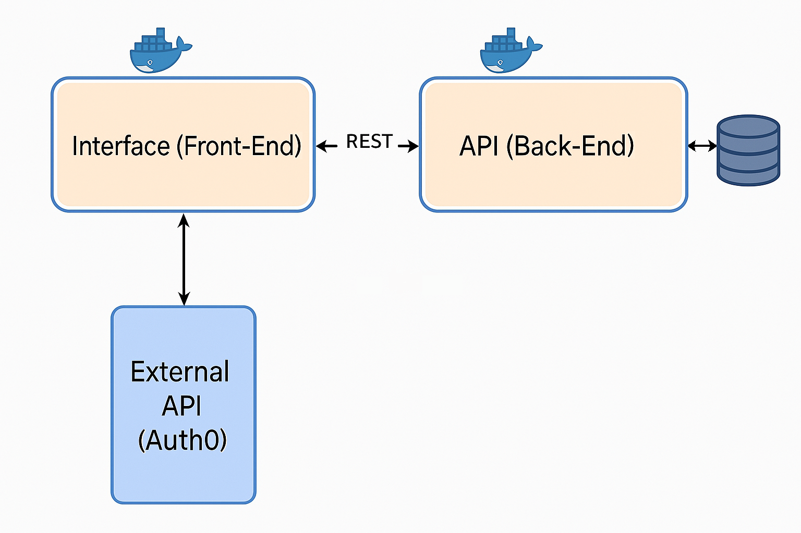

# GranaBox - Frontend

This is the frontend of the **GranaBox** application, developed as part of the **Software Engineering** course at **PUC Rio**. The GranaBox application is designed to help users manage their personal finances by categorizing income and expenses, providing a simple and intuitive dashboard to track their financial status in real-time.

## Table of Contents

- [Overview](#overview)
- [Architecture Overview](#architecture-overview)
- [Features](#features)
- [Technologies](#technologies)
- [Installation](#installation)
- [Usage](#usage)
- [External API - Auth0](#external-api---auth0-authentication-provider)
- [Contributing](#contributing)
- [License](#license)
- [Contact](#contact)

## Overview

GranaBox is a personal finance management tool that enables users to:
- Organize their income and expenses by categories.
- Track their monthly financial status in an intuitive dashboard.
- Add, edit, and delete transactions, reflecting real-time updates.
- View financial summaries, such as pending payments, completed transactions, and overall income.

This frontend communicates with the GranaBox backend API, where the data is managed and stored.

## Architecture Overview

The diagram below illustrates how the GranaBox application is structured and how its components interact, including the use of Auth0 as an external authentication provider.


*System architecture showing how the frontend, backend, Auth0, and database interact via Docker and REST APIs.*

## Features

- **Interactive Dashboard**: Displays categorized transactions and financial progress.
- **Dynamic Form Modals**: Add or update transactions with real-time interaction.
- **Drag and Drop Interface**: Easily move items between categories (e.g., from pending to paid).
- **RESTful API Integration**: Communicates with the backend to fetch, create, and update data.
- **Responsive Design**: Ensures smooth usage across desktop and mobile devices.

## Technologies

The following technologies were used in the development of this project:

- **HTML5**: For structuring the frontend content.
- **CSS3**: For layout and styling.
- **JavaScript (Vanilla)**: For frontend logic and interaction.

## Installation

### Prerequisites
Before running the project, ensure you have the following installed:
- [Docker](https://www.docker.com/)
- [Docker Compose](https://docs.docker.com/compose/)
- A modern web browser (Chrome, Firefox, etc.)

### Steps

1. **Clone the repository**:

   ```bash
   git clone https://github.com/thiagosnuness/granabox_frontend.git
   git clone https://github.com/thiagosnuness/granabox_backend.git
   ```

2. **Navigate to the project folder** (which contains the `docker-compose.yml` file):

   ```bash
   cd granabox_frontend
   ```

3. **Run the entire application (frontend + backend)** using Docker Compose:
   
   ```bash
   docker-compose up --build
   ```

4. **Access the application**:

   Open your browser and go to [http://localhost](http://localhost)

   You will be redirected to the login page (via Auth0) and, after authentication, the dashboard will load.

   You can explore all available backend endpoints via Swagger UI: [http://localhost:5000/openapi/](http://localhost:5000/openapi/)

## Usage

### Adding Transactions
1. Click on the **Add Transaction** button.
2. Fill out the transaction details (category, amount, date).
3. Click **Save** to submit. The transaction will appear in the appropriate section (Income or Expenses).

### Managing Transactions
- **Drag and Drop** transactions between the **Pending** and **Paid** sections.
- **Edit**: Click the edit icon next to a transaction to modify its details.
- **Delete**: Remove a transaction by clicking the delete icon.

### Filtering by Date
1. Use the **Month** and **Year** selectors to view transactions from specific periods.
2. The dashboard will automatically update based on the selected filters.

## External API - Auth0 (Authentication Provider)

This application uses **Auth0**, a public and free authentication API, to securely manage user login and session handling.

- Official documentation: [https://auth0.com/docs](https://auth0.com/docs)

### Why Auth0?

Auth0 was chosen for the following reasons:

- It offers secure authentication using industry standards like OAuth2 and OpenID Connect.
- It integrates seamlessly with the frontend and backend, allowing each user to securely manage their own financial data.
- It supports login using Google accounts or email/password registration.

### How does it work?

- When you access the GranaBox application, you'll be redirected to the Auth0 login screen.
- You can log in using your **Google account** or **create a new Auth0 account** with your email.
- After logging in, you are automatically redirected to the application dashboard.
- From that point on, all your data is securely linked to your account and visible only to you.

> You don’t need to configure anything manually. Just log in and start managing your finances.

### Licensing

Auth0 offers a **free tier** suitable for personal projects, MVPs, and educational use. For more advanced features or higher usage limits, commercial plans are available.

### Account Registration

Users do **not** need to register with Auth0 manually. The application handles all authentication steps. During login, users can either:
- Use their **Google account**
- Or register with **email and password** directly on the Auth0-hosted login screen

### Auth0 API Routes Used

Internally, the application communicates with Auth0 using the following standard OpenID Connect endpoints:

- `https://YOUR_DOMAIN/authorize` – Initiates the login redirect flow
- `https://YOUR_DOMAIN/oauth/token` – Exchanges authorization code for tokens
- `https://YOUR_DOMAIN/userinfo` – Fetches the authenticated user’s profile (name, email)

> These routes are used via Auth0’s SDKs and do not require direct integration or backend calls from the GranaBox application.

## Contributing

Contributions are welcome! To contribute to this project:

1. Fork the repository.
2. Create a new branch (`git checkout -b feature-branch`).
3. Make your changes and commit (`git commit -am 'Add new feature'`).
4. Push to the branch (`git push origin feature-branch`).
5. Create a new Pull Request.

## License

This project is licensed under the **MIT License**. See the [LICENSE](./LICENSE) file for more details.

## Contact

For any questions, feedback, or suggestions, feel free to reach out:

- **Thiago Nunes** - [GitHub Profile](https://github.com/thiagosnuness)
- **Project Frontend Repository**: [GranaBox Frontend](https://github.com/thiagosnuness/granabox_frontend)
- **Project Backend Repository**: [GranaBox Backend](https://github.com/thiagosnuness/granabox_backend)
